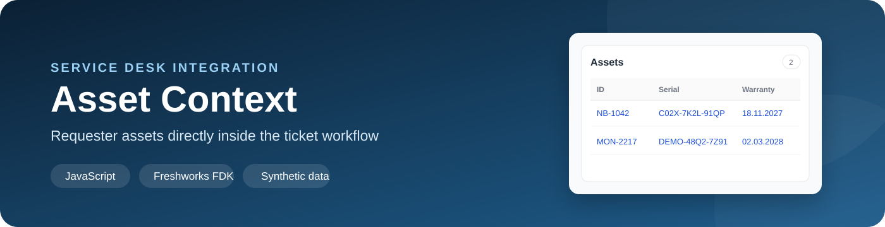
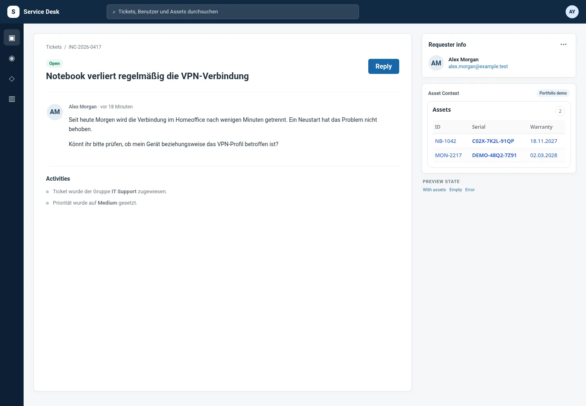
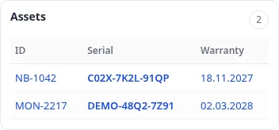
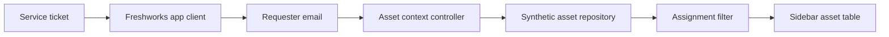

<p align="center">
  
</p>

<p align="center">
  <strong>A privacy-safe Freshworks/Freshservice portfolio demo that shows requester assets inside the ticket sidebar.</strong>
</p>

<p align="center">
  
  
  
  
</p>

## Overview

Asset Context helps support agents understand which devices belong to the requester without leaving the ticket. The compact widget reads the requester email, finds matching synthetic assets, and displays the asset ID, serial number and warranty date in the requester sidebar.

The public repository is an **independently rewritten demonstration**. Its widget was reviewed against the original application's layout and state behavior, while all production credentials, API paths, internal IDs, real records and employer code were excluded.

## Original-looking product experience

The widget deliberately stays very close to the original visual implementation:

- compact white card with a subtle border and 10 px radius;
- 14 px **Assets** heading and outlined count pill;
- muted sticky table header;
- columns for ID, serial and warranty;
- alternating rows, hover feedback and blue record links;
- matching loading spinner, empty state and error card;
- sidebar-friendly spacing and typography.

The larger ticket screen in `preview/` is a neutral portfolio shell. It provides context without copying Freshservice branding or production tenant details.

<p align="center">
  
</p>

<p align="center">
  
</p>

## Technical implementation



The public code includes:

- Freshworks app initialization and `app.activated` handling;
- requester lookup from `contact`, `ticket` or `requester` context;
- normalization and filtering by requester email;
- neutral asset field mapping;
- loading, success, empty and error states;
- HTML escaping and safe local record links;
- a Freshworks platform 3.0 manifest;
- a Dockerized standalone ticket preview;
- unit-style smoke tests for mapping and filtering.

## Production concept vs. public demo

| Area | Original production concept | Public portfolio demo |
|---|---|---|
| Ticket context | Freshservice requester sidebar | Freshworks manifest plus standalone preview |
| Requester lookup | Freshworks app client | Implemented |
| Asset source | External asset-management API | Local synthetic repository |
| Authentication | Service credentials and access token | Not included |
| Token cache | Short-lived frontend cache | Documented, not simulated as real authentication |
| Search | External API request by email | Local email filter |
| Field mapping | Production-specific field identifiers | Neutral public data model |
| Links | Real source asset records | Local synthetic detail dialog |
| Data | Real operational records | Fully fictional records |

This distinction is intentional. See [Production concept vs. demo](docs/PRODUCTION_VS_DEMO.md), [Feature parity](docs/FEATURE_PARITY.md) and [Architecture](docs/ARCHITECTURE.md).

## Preview locally

### Windows

1. Start Docker Desktop.
2. Double-click `START_HERE.cmd`.
3. Open **http://localhost:8082**.

### macOS / Linux

```bash
./start-mac-linux.sh
```

### Manual Docker start

```bash
docker compose up --build
```

The preview provides three states:

- **With assets**
- **Empty**
- **Error**

## Freshworks app structure

```text
freshservice-asset-lookup/
├── app/
│   ├── index.html
│   ├── scripts/
│   │   ├── app.js
│   │   └── core.js
│   └── styles/
├── config/
├── docs/
├── preview/
├── tests/
├── manifest.json
└── docker-compose.yml
```

The external request templates used by the production concept are intentionally absent. Publishing sanitized placeholders would make the demo appear connected when it is not.

## Quality checks

```bash
npm test
```

Checks cover:

- requester-email normalization;
- asset field mapping;
- assignment filtering;
- date formatting;
- HTML escaping;
- JSON validity;
- absence of production API hosts, group IDs and field IDs;
- required transparency documentation.

## Privacy and ownership

This repository contains no:

- production source-code copy;
- API password, token or service-account identifier;
- internal API host, path, group ID or field ID;
- real requester, employee, ticket or asset record;
- Freshservice tenant information;
- production log, FDK cache, database or coverage output.

See [SECURITY.md](SECURITY.md) and the completed [review checklist](docs/REVIEW_CHECKLIST.md).

## License

[MIT](LICENSE)
