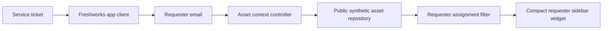
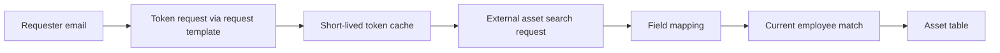

# Architecture

## Public demo runtime

The same UI can run in two contexts:

1. **Freshworks context** — the app waits for activation and reads `contact`, `ticket` or `requester` data through the platform client.
2. **Standalone preview** — a fictional requester email is supplied by the preview shell.

The public asset repository is an in-memory synthetic dataset. It deliberately has no external network dependency.

## Original production concept

The internal concept extended the controller with an external asset gateway:

Production API templates, credentials, field identifiers and asset-system URLs are not published.

## Separation of concerns

- `core.js`: normalization, field mapping, filtering and date formatting;
- `app.js`: platform activation, requester lookup, loading/error/empty states and rendering;
- `style.css`: compact sidebar appearance matching the original app;
- `preview/`: generic service-desk shell for portfolio presentation only.
